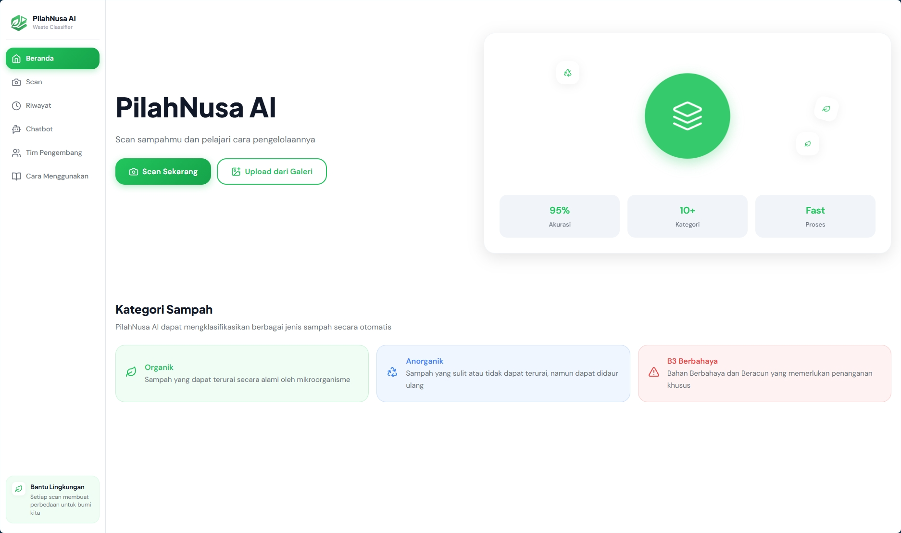

# PilahNusa AI



PilahNusa AI adalah aplikasi web mobile-first untuk membantu pengguna memilah sampah melalui foto. Pengguna dapat mengambil atau mengunggah gambar sampah, lalu aplikasi akan mengklasifikasikan jenis sampah tersebut dan menampilkan panduan pembuangan, tips daur ulang, serta riwayat pemindaian.

Aplikasi ini menggunakan frontend React + Vite, backend Node.js/Express, model klasifikasi gambar berbasis TensorFlow.js, dan chatbot edukasi pemilahan sampah yang terhubung ke Gemini API.

## Fitur Utama

- Klasifikasi sampah dari gambar menggunakan model Machine Learning.
- Panduan pembuangan dan tips daur ulang berdasarkan hasil klasifikasi.
- Riwayat pemindaian sampah.
- Chatbot edukasi pengelolaan sampah dalam Bahasa Indonesia.
- Tampilan responsif yang dioptimalkan untuk perangkat mobile.

## Tech Stack

- Frontend: React 18, Vite, React Router DOM, Lucide React
- Backend: Node.js, Express, Multer, Sharp
- Machine Learning: TensorFlow.js
- AI Chatbot: Gemini API

## Struktur Proyek

```text
PilahNusa-AI/
├── public/                     # Aset statis
├── server/                     # Aplikasi backend Express
│   ├── controllers/            # Logic API, klasifikasi ML, dan chatbot
│   ├── data/                   # Data lokal dan model TensorFlow.js
│   │   └── tfjs_model/         # model.json dan file bobot .bin
│   ├── middleware/             # Middleware Express
│   ├── models/                 # Model penyimpanan data
│   ├── routes/                 # Definisi route API
│   └── server.js               # Entry point backend
├── src/                        # Aplikasi frontend React
│   ├── components/             # Komponen UI
│   ├── hooks/                  # Custom hooks
│   ├── pages/                  # Halaman aplikasi
│   ├── services/               # Integrasi API frontend
│   └── utils/                  # Helper function
├── .env.example                # Contoh konfigurasi environment
├── package.json                # Dependensi dan script npm
└── vite.config.js              # Konfigurasi Vite dan proxy API
```

## Petunjuk Setup Environment

### 1. Prasyarat

Pastikan perangkat sudah memiliki:

- Node.js versi 16 atau lebih baru
- npm
- Git

Untuk mengecek versi:

```bash
node -v
npm -v
git --version
```

### 2. Clone Repository

```bash
git clone <repository-url>
cd PilahNusa-AI
```

Jika project sudah tersedia di komputer lokal, cukup masuk ke folder project:

```bash
cd PilahNusa-AI
```

### 3. Install Dependensi

Jalankan perintah berikut dari root project:

```bash
npm install
```

Perintah ini akan menginstal dependensi frontend dan backend yang didefinisikan di `package.json`.

### 4. Konfigurasi Environment Variable

Buat file `.env` dari template `.env.example`.

Linux/macOS:

```bash
cp .env.example .env
```

Windows PowerShell:

```powershell
Copy-Item .env.example .env
```

Isi nilai berikut di file `.env`:

```env
GEMINI_API_KEY=masukkan_api_key_gemini_anda
```

Keterangan:

- `GEMINI_API_KEY` digunakan oleh fitur chatbot edukasi sampah.
- Jika API key belum diisi, fitur klasifikasi sampah tetap dapat berjalan, tetapi chatbot akan gagal menjawab.
- Backend menggunakan port `5000` secara default. Jika ingin mengganti port, tambahkan `PORT` di file `.env`.

Contoh:

```env
GEMINI_API_KEY=masukkan_api_key_gemini_anda
PORT=5000
```

## Tautan Model Machine Learning

Model Machine Learning yang digunakan adalah model TensorFlow.js Graph Model dan sudah disertakan di dalam repository pada folder:

```text
server/data/tfjs_model/
```

File utama model:

```text
server/data/tfjs_model/model.json
```

File bobot model:

```text
server/data/tfjs_model/group1-shard*.bin
```

Saat ini tidak diperlukan tautan download eksternal karena model sudah tersedia secara lokal di repository. Backend akan memuat model secara otomatis dari:

```text
server/data/tfjs_model/model.json
```

Jika ingin mengganti model:

1. Pastikan model baru sudah dikonversi ke format TensorFlow.js Graph Model.
2. Ganti file `model.json` dan semua file bobot `.bin` di folder `server/data/tfjs_model/`.
3. Jika input layer, ukuran gambar, atau jumlah kelas berubah, sesuaikan logic di `server/controllers/classificationController.js`.
4. Jika label kelas berubah, perbarui `CLASS_LABELS` dan `CLASS_DATA_MAP` di file yang sama.

## Cara Menjalankan Aplikasi

### Menjalankan Frontend dan Backend Sekaligus

Gunakan perintah berikut dari root project:

```bash
npm run dev:all
```

Perintah ini menjalankan:

- Frontend Vite di `http://localhost:5173`
- Backend Express di `http://localhost:5000`

Buka aplikasi melalui browser:

```text
http://localhost:5173
```

Frontend sudah memiliki proxy Vite untuk meneruskan request `/api` ke backend `http://localhost:5000`.

### Menjalankan Frontend Saja

```bash
npm run dev
```

Frontend akan berjalan di:

```text
http://localhost:5173
```

### Menjalankan Backend Saja

```bash
npm run server
```

Backend akan berjalan di:

```text
http://localhost:5000
```

## Script yang Tersedia

```bash
npm run dev
```

Menjalankan frontend Vite.

```bash
npm run server
```

Menjalankan backend Express.

```bash
npm run dev:all
```

Menjalankan frontend dan backend secara bersamaan.

```bash
npm run build
```

Membuat build production frontend.

```bash
npm run preview
```

Menjalankan preview build production Vite.

```bash
npm run lint
```

Menjalankan ESLint untuk memeriksa kualitas kode.

## Alur Klasifikasi Sampah

1. Pengguna mengambil atau mengunggah gambar sampah dari frontend.
2. Frontend mengirim gambar ke endpoint backend `/api/classifications`.
3. Backend memproses gambar menggunakan `sharp`:
   - resize ke 224x224 piksel
   - konversi ke format RGB
   - normalisasi nilai piksel ke rentang 0 sampai 1
4. TensorFlow.js memuat model dari `server/data/tfjs_model/model.json`.
5. Model menghasilkan prediksi kelas sampah.
6. Backend mengembalikan hasil klasifikasi, tingkat confidence, deskripsi, panduan pembuangan, dan tips daur ulang.
7. Hasil disimpan ke riwayat pemindaian.

## Catatan Troubleshooting

- Jika chatbot gagal, pastikan `GEMINI_API_KEY` sudah benar di file `.env`.
- Jika klasifikasi gagal saat server pertama kali dijalankan, cek apakah folder `server/data/tfjs_model/` berisi `model.json` dan semua file `.bin`.
- Jika frontend tidak dapat mengakses API, pastikan backend berjalan di port `5000`.
- Jika port `5173` atau `5000` sudah digunakan, hentikan proses yang memakai port tersebut atau ubah konfigurasi port.
